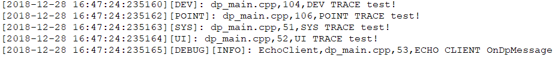

# 日志解析工具用户手册

##

日志模块生成的日志源文件根据日志类型分为多文件存储，并且内容中存在二进制信息，不方便用户直接阅读源文件。日志解析工具用于解析日志源文件并根据时间顺序将各类型日志合并为一个文件，便于用户直接通过日志文件分析问题。

该工具支持用户自定义日志类型组合、支持自定义输入输出路径，可直接运行于相机设备，也可以将日志文件导出到Windows上解析，解析后的文件为：log_all.txt，存储在工具运行路径下。

## 1. 日志类型定义：

	  LT_DEBUG = 0x01  		// 调试日志
	  LT_POINT  = 0x02  	// 业务流程日志
	  LT_SYS    = 0x04  	// 系统日志
	  LT_DEV    = 0x08  	// 设备日志
	  LT_UI      = 0x10  	// 用户操作日志

## 2. 工具名称：

- 2.1. Win32：log_parser_win32

		(1) 将该工具放到日志目录下，直接运行(使用默认参数)
		(2) 命令行运行：./log_parser_linux -s c:\log -m 15
- 2.2 Linux：log_parser_linux

		$ ./log_parser_linux -s ./log -m 15

## 3. 参数说明：

	-s：<log file source files folder>
	自定义日志源文件搜索路径，用户需要提前将各类型日志文件导出到该目录下；
	如果未指定，默认路径为版本中日志生成路径，用户无需关注。
	-t: <target file folder>
	自定义生成的解析文件存放路径；默认为工具当前路径。
	-m: <log type mask>
	自定义日志类型，为各类型日志定义的mask值；默认为所有的日志类型。

## 4. 解析后文件示例：

	格式：#年-月-日 时:分:秒:微秒[日志类型][Debug日志级别]:日志内容

